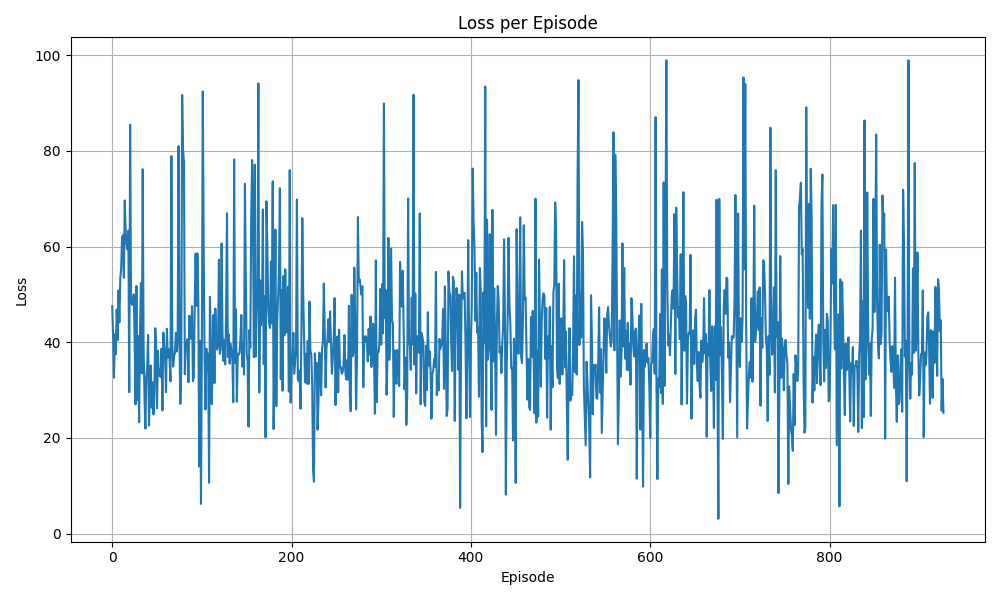
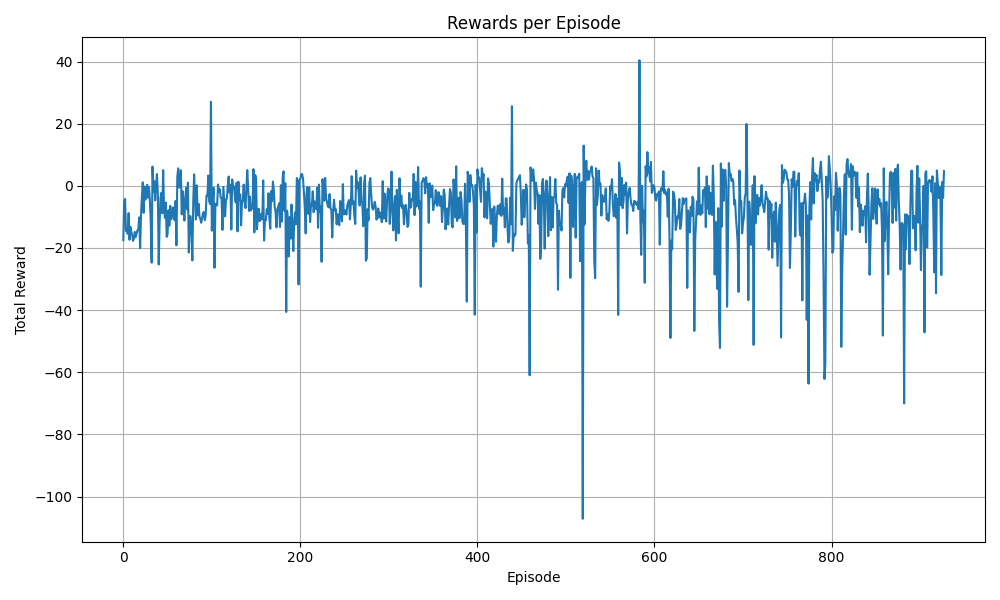

# RL Car Simulation

> A Reinforcement Learning based autonomous car simulation using Deep Q-Networks (DQN) and Pygame.


## Overview

This project implements a self-driving car simulation where an agent learns to navigate a track using Deep Q-Learning. The car perceives its environment through sensors and learns to avoid obstacles and stay on the road. The simulation is built with Pygame for visualization and PyTorch for the neural network backend.

## Features

- **Deep Q-Learning Agent**: Uses a neural network to approximate the Q-value function.
- **Custom Map Builder**: Create and save your own tracks.
- **Real-time Visualization**: Watch the car learn and improve over time.
- **Performance Metrics**: Track loss and reward progression during training.
- **Save/Load Models**: Persist trained models and resume training or run inference.

## Project Structure

```
.
├── assets/             # Images and graphs
├── saved_maps/         # User-created maps
├── saved_models/       # Trained models and logs
├── src/
│   ├── App/            # Game logic and simulation
│   ├── MachineLearning/# DQN implementation
│   └── Utils/          # Helper functions and settings
├── main.py             # Entry point
└── requirements.txt    # Dependencies
```

## Installation

1.  **Clone the repository:**
    ```bash
    git clone [REPO_URL]
    cd [REPO_NAME]
    ```

2.  **Create a virtual environment (optional but recommended):**
    ```bash
    python -m venv venv
    # Windows
    venv\Scripts\activate
    # macOS/Linux
    source venv/bin/activate
    ```

3.  **Install dependencies:**
    ```bash
    pip install -r requirements.txt
    ```

## Usage

**Run the simulation (GUI mode):**
```bash
python main.py
```

**Run in background (training mode):**
```bash
python main.py --background --map "SanFrancisco" --min-epsilon
```

**Arguments:**
- `--background`: Run without rendering the window (faster training).
- `--map [MAP_NAME]`: Load a specific map directly.
- `--min-epsilon`: Stop training when the exploration rate reaches its minimum.
- `--verbose [0-3]`: Set verbosity level.

## Examples & Results

### Training Progress

**Loss Curve:**


**Reward Curve:**


## Configuration

Settings can be adjusted in `src/Utils/global_settings.py`. Key parameters include:
- `WIDTH`, `HEIGHT`: Window dimensions.
- `Q_LEARNING_SETTINGS`: Hyperparameters for the DQN agent (learning rate, gamma, epsilon decay, etc.).

## Contributing

Contributions are welcome! Please open an issue or submit a pull request for any improvements or bug fixes.

## License

This project is licensed under the MIT License - see the [LICENSE](LICENSE) file for details.
