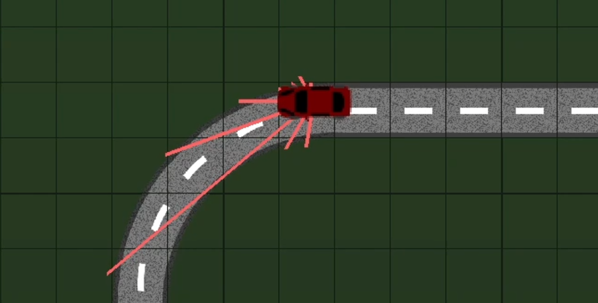

# 🚗 **RL Car Simulation**

### *A Reinforcement Learning-based Autonomous Driving Simulation using Deep Q-Networks (DQN) and PyGame*

---

## 🧠 **Overview**

This project demonstrates an **autonomous driving simulation** powered by **Deep Q-Learning (DQN)**, where a virtual car learns to navigate complex tracks, avoid collisions, and optimize driving efficiency — **all through experience**.

The agent perceives its surroundings using simulated **distance sensors**, processes observations through a **neural network**, and takes optimal driving actions based on learned Q-values.
Built with **PyGame** for visualization 🎮 and **PyTorch** for the deep learning backend 🔥, the project provides a seamless integration of AI learning and interactive simulation.



---

## ⚙️ **Key Features**

✅ **Deep Q-Learning Agent:**
Trains a neural network to approximate the Q-value function for intelligent driving decisions.

🗺️ **Custom Map Builder:**
Design and save your own driving tracks.

🎥 **Real-time Visualization:**
Observe the car as it learns to drive smarter over time.

📊 **Performance Tracking:**
Monitor **reward curves**, **loss curves**, and training progress with detailed logs.

💾 **Save & Load Models:**
Easily persist and reload trained models for evaluation or further training.

---

## 🧩 **Project Structure**

```bash
.
├── assets/             # Images, visualizations, and training graphs
├── saved_maps/         # User-created maps and tracks
├── saved_models/       # Trained models, checkpoints, and logs
├── src/
│   ├── App/            # Core simulation and control logic
│   ├── MachineLearning/# DQN architecture and agent logic
│   └── Utils/          # Helper functions, constants, and global settings
├── main.py             # Entry point for simulation and training
└── requirements.txt    # Python dependencies
```

---

## 🚀 **Installation**

### 🧾 Clone the Repository

```bash
git clone https://github.com/sam12fak/Autonomous-Driving-Using-Reinforcement-Learning-.git
cd Autonomous-Driving-Using-Reinforcement-Learning-
```

### 🧱 Create a Virtual Environment (Recommended)

```bash
python -m venv venv
# Windows
venv\Scripts\activate
# macOS/Linux
source venv/bin/activate
```

### 📦 Install Dependencies

```bash
pip install -r requirements.txt
```

---

## 🏁 **Usage**

### ▶️ Run the Simulation (GUI Mode)

```bash
python main.py
```

### ⚡ Train in Background (Headless Mode)

```bash
python main.py --background --map "SanFrancisco" --min-epsilon
```

### 🧠 Arguments

| Argument           | Description                                          |
| ------------------ | ---------------------------------------------------- |
| `--background`     | Runs without rendering for faster training           |
| `--map [MAP_NAME]` | Loads a specific track                               |
| `--min-epsilon`    | Stops training when exploration rate reaches minimum |
| `--verbose [0-3]`  | Sets verbosity level for logging                     |

---

## 📈 **Examples & Results**

### 🏎️ Training Progress

The car starts with random movements and gradually learns to stay on the road, avoid obstacles, and maximize cumulative rewards.

**Loss Curve:**
Shows the reduction in Q-value prediction error over time.


**Reward Curve:**
Displays increasing stability and reward gains as the agent converges.


🖼️ *Visual outputs and graphs can be found in the `assets/` directory.*

---

## ⚙️ **Configuration**

Adjust core simulation and learning parameters in:
📂 `src/Utils/global_settings.py`

**Key Parameters:**

* `WIDTH`, `HEIGHT`: Simulation window dimensions
* `Q_LEARNING_SETTINGS`: Contains hyperparameters such as:

  * Learning rate (α)
  * Discount factor (γ)
  * Epsilon decay schedule
  * Replay buffer size
  * Target update frequency

---

## 🧪 **Technical Highlights**

* Implementation of **Deep Q-Network (DQN)** using PyTorch
* Experience replay and target network stabilization
* Custom reward functions for lane-following and collision avoidance
* Modular and scalable simulation design
* Compatible with any custom map generated in PyGame

---

## 🤝 **Contributing**

Contributions are highly encouraged!

* Fork the repo
* Create a feature branch
* Commit your changes
* Open a pull request

Issues, feature requests, or performance improvements are welcome!

---

## 📜 **License**

This project is licensed under the **MIT License** — see the [LICENSE](./LICENSE) file for details.

---

## 🧭 **Future Enhancements**

🔹 Integration with **Double DQN / Dueling DQN** for improved stability
🔹 Addition of **continuous control (DDPG / PPO)**
🔹 Implementation of **traffic and pedestrian agents**
🔹 Visualization dashboard for training analytics

---

### 🌟 *“Teaching cars to drive — one reward at a time.”*
